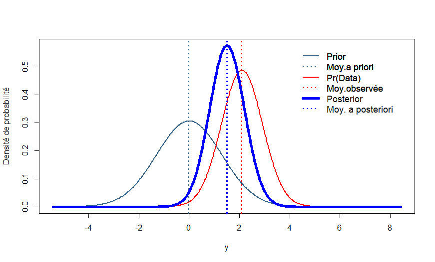

# Principes de la statistique Bayésienne

## Notion d’hypothèse scientifique et d’hypothèse statistique.  

Une théorie sur un phénomène permet de formuler une hypothèse scientifique sur un paramètre d’intérêt. Cette hypothèse scientifique va être traduite en hypothèse statistique, laquelle sera soumise à un test qui vise à valider ou invalider l’hypothèse scientifique. L’hypothèse scientifique est vraie ou fausse mais l’hypothèse statistique, elle, a une certaine probabilité d’être vraie. L'objet de la statistique bayésienne est de calculer la probabilité d'une hypothèse. Le test statistique suppose le recueil de données (les « évènements » de la théorie des probabilités) qui permettront en retour d’estimer la probabilité que cette hypothèse statistique soit vraie. Lorsque cette probabilité est suffisamment élevée (basse) on pourra considérer que l’hypothèse scientifique est validée (invalidée). 


## Notion de probabilité.  

La probabilité d’un évènement d’intérêt E est souvent définie comme la proportion de cas où E survient parmi une série finie de résultats possibles et équiprobable d’une expérience aléatoire. Cette définition suppose que l'on puisse énumérer tous les cas possibles et tous les cas correspondants à E, avant de les observer. 

La probabilité peut aussi être définie comme la proportion de cas ou E est observé parmi une série de cas. Cette définition assimile la fréquence de E à la probabilité de cet évènement E. On parle alors de probabilité fréquentiste. Par exemple, sur un échantillon de 100 sujets atteints d'une maladie, on observe 80 guérisons. La probabilité fréquentiste de guérison est alors de 0,80 en l'assimilant à la proportion observée de guérison. 

Ces définitions ne permettent cependant pas de connaitre  d'un évènement unique (comme la réussite à un examen ou la guérison d'un malade en particulier). Elles ne permettent pas non plus de connaitre la probabilité d'une théorie ou la probabilité qu’une hypothèse sur un paramètre soit vraie. Par exemple, elles ne permettent pas de connaître la probabilité qu'un Odds-Ratio (OR) soit comris entre 1,2 et 1,4 dans la population. En effet, elles définissent la probabilité de l’évènement E sachant une valeur théorique du paramètre dans la population et pas la probabilité du paramètre dans la population sachant les données observées. Elles supposent donc connue la valeur de l'OR dans la population que justement on cherche à connaitre. Pour connaitre cette valeur de l'OR (l'hypothèse sur l'OR) il faut recourir à la définition épistémique de la probabilité qui définit la probabilité comme le degré de crédibilité que l’on donne à une hypothèse sur le paramètre dans la population. Cette probabilité s'applique donc à un jugement. La statistique bayésienne repose explicitement sur cette définition épistémique de la probabilité même si elle utilise également les définitions classiques au cours des calculs. 

Cette définition est donc particulièrement utile dans le domaine scientifique où le but est de créer de la connaissance, définie par Aristote comme une croyance vraie et justifiée. L'outil mathématique permettant de transformer le niveau de crédibilité d'une hypothèse en une connaissance est le théorème de Bayes. Ce théorème combine une crédibilité « a priori » sur l’hypothèse portant sur la valeur du paramètre avec l’information contenue dans les données observées via le calcul de leur vraisemblance. Le résultat de la combinaison s’exprime dans une loi dite « a posteriori » qui contient toute l’information utile disponible sur le paramètre d’intérêt. 
**Dans la présente aide, nous utiliserons de manière générique le symbole $\theta$ pour parler d'un paramètre, qui peut être une moyenne, une variance, une différence de moyennes ou de proportions, un coefficient de corrélation, un OR, un Hazard-Ratio (HR) etc.** 

Le théorème de Bayes peut s’énoncer ainsi : la connaissance a posteriori sur le paramètre $\theta$ est proportionnelle à la croyance a priori sur $\theta $ multipliée par la probabilité des données D : 

\begin{equation}
\Pr(\theta|D) \propto Pr(\theta) \times  \Pr(D|\theta)
\end{equation}

**En synthèse**, la statistique bayésienne permet la mise à jour d’une connaissance probabiliste sur un paramètre à l’aide d’observations.

Les trois éléments d’une analyse bayésiennes sont donc : 

1. **La loi a priori** : c’est une loi de probabilité (par exemple une loi normale) qui exprime toute la connaissance dont on dispose sur le paramètre avant la collecte des données. Pour chaque analyse, il faut spécifier les caractéristiques de la loi a priori (par exemple moyenne et variance dans le cas de la loi normale) exprimant la connaissance disponible sur $\theta$. La détermination de cette loi a priori est appelée élicitation ; c’est une étape très importante dans l’inférence bayésienne et SHIBA vous permettra de  franchir cette étape facilement. 

2. **La vraisemblance** : c’est la probabilité des données observées conditionnellement aux valeurs a priori du paramètre (dont vous n’avez pas à vous souciez et qui n’apparait pas dans les résultats)

3. **La loi a posteriori** : c’est une loi de probabilité qui exprime toute la connaissance dont on dispose sur le paramètre $\theta$ étudié après la collecte des données. Cette loi a posteriori est calculée par SHIBA et sa description permet de fournir une estimation de $\theta$ ainsi que la probabilité des différentes hypothèses formulées par l’utilisateur. Elle est également la base de test statistique sur la valeur de $\theta$.

Le paramètre d’intérêt (comme par exemple une moyenne d’amélioration d’une grandeur biologique) est souvent le paramètre d’une loi de probabilité (une loi normale pour la moyenne, une loi Beta pour une proportion) mais il est parfois le résultat d’une transformation d’un autre paramètre. Lors de la comparaison de deux proportions, l’OR ne dispose pas d’une loi a priori propre, il n’est pas le paramètre d’une loi a priori. Sa loi a posteriori est en fait recalculée à partir de la loi a posteriori des proportions dans chaque groupe des sujets exposés et non-exposés ou de la loi a posteriori du paramètre d’une régression logistique.

Dans le graphique suivant, la loi a priori est en bleu métalique, la vraisemblance est en rouge, la loi a posteriori est en bleu vif. 

```{r, echo=FALSE,fig.align = 'center'}




```

**à caser quelque part** SHIBA étant basé sur STAN, il peut utiliser des lois a priori par défaut mais nous vous suggérons très fortement de spécifier des lois a priori aussi souvent que possible pour bénéficier de tous les avantages des méthodes bayésiennes. Une loi a priori par défaut ne peut pas, par définition, être adaptée à toutes les situations. Si elle permet d'avoir mécaniquement un résultat, ce résultat ne sera la plupart du temps pas pertinente dans le contexte dans lequel vous avez établi votre modèle. 

**définir aussi** ce qui est informatif et ce qui ne l'est pas. 


Dans les différents onglets de SHIBA, la démarche globale sur le plan statistique est à chaque fois la même. Pour un modèle donné (une proportion, une régression logistique, etc.), il faudra spécifier une loi a priori pour chacun des paramètres d’intérêt ou des éléments composant le paramètre d’intérêt (pour un risque relatif ou un odds-ratio par exemple). SHIBA effectue le calcul de la loi a posteriori du ou des paramètres et permet de réaliser les tests que vous aurez éventuellement spécifié.


Notez que le temps de calcul pour une analyse bayésienne peut être notablement plus long qu'avec les méthodes classiques. Ce temps dépend à la fois du nombre de données et de la complexité du modèle qui déterminent le nombre de lois a posteriori à estimer. Plus le nombre de lois à estimer est important, plus le temps de calcul est long. Ce phénomène s'observe surtout avec les modèles mixtes. 
